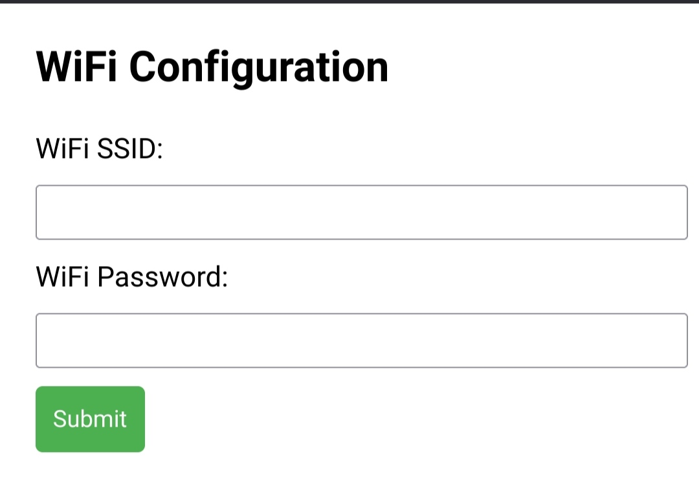
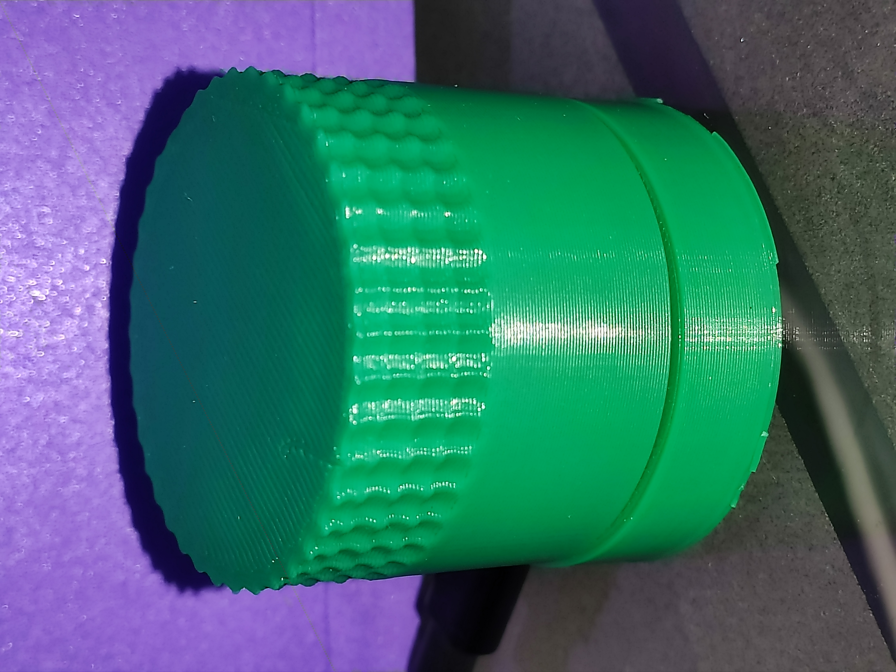
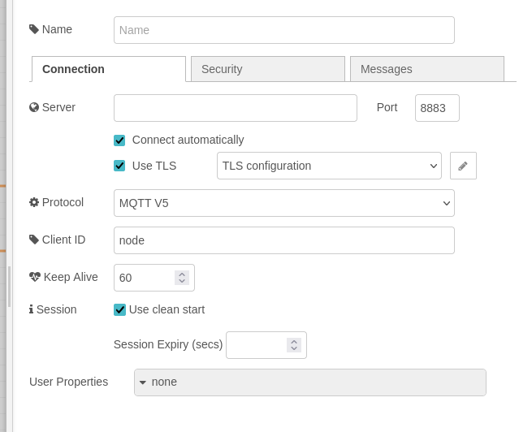
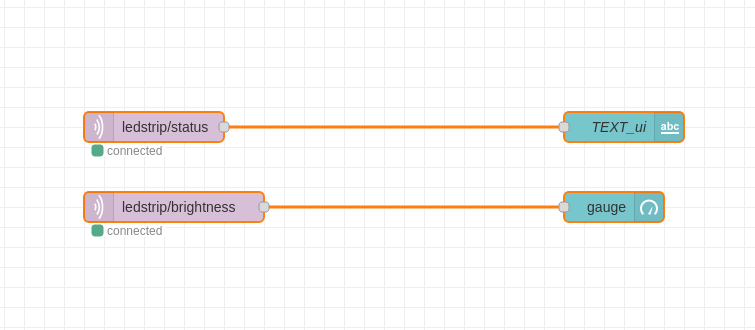
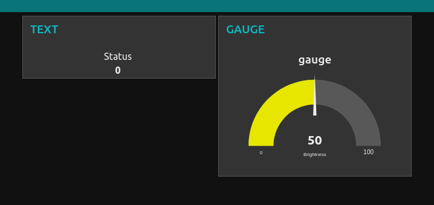

# MQTT Proof of Concept


This project uses HiveMQ MQTT cloud server. Mosquitto can be used for a local configuration. 
Perhaps using micropython is not te most reliable way for programming embedded systems, but it works as a quick PoC.

A PNP transistor is used to drive a 12V LED strip.

2 separated ESP32-C3s are used, one publishes to the MQTT broker(`mqtt_encoder`), and the other is subscibed to the topics(`mqtt_ledstrip`).

# WIFI
If no `wifi_credentials.json` file is found, the ESP32 is configured as a Hotspot:

```python

ap.config(essid='ESP32_Hotspot', password='password')

```

When a phone is connected to the network, accessing `192.168.4.1` with a browser, the following view appears:



When the form is submitted, the ESP32 saves the credentials in a `.json`. After reboot, if credentials are valid, it will be connected to the WIFI network.

# MQTT_SERVER

An extra `.json` file named `mqtt_credentials.json` is used to store the MQTT_SERVER ip. 

# Case

A case was design with OnShape for the Encoder.




# Using Node-RED

The Docker image was used to test NodeRED.

>- Note: If using NodeRED with HiveMQ, enable TLS.

## Config



## Block Diagram



## Dashboard




# Resources

[Getting Started with Raspberry Pi Pico W for IoT: Micropython and MQTT](https://www.hivemq.com/article/iot-reading-sensor-data-raspberry-pi-pico-w-micropython-mqtt-node-red/) 