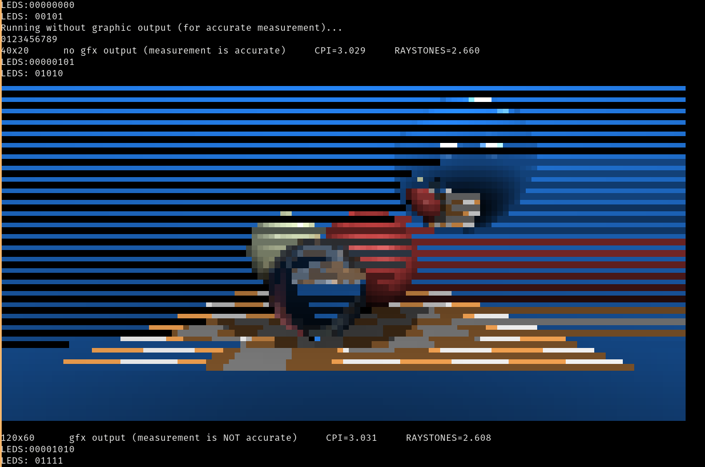

>- FOLLOWING: [Tutorial - Blinky to RISC-V](https://github.com/BrunoLevy/learn-fpga/blob/master/FemtoRV/TUTORIALS/FROM_BLINKER_TO_RISCV/README.md)

# Step1 - Separated Memories
A chip with 128kB of BRAM is suggested. 
I'm trying to adapt the code to a 32kB board.
2kB of BRAM are used for the registers. So 30kB are left.
15kB for PROGROM and 15kB for DATARAM

```verilog
   reg [31:0] PROGROM [0:3839]; // 3840 * 32 / (8*1024) = 15kB // LENGTH = 0x3C00
   reg [31:0] DATARAM [0:3839]; // 3840 * 32 / (8*1024) = 15kB // LENGTH = 0x3C00
``` 

For now, a 64kB PROGROM and DATARAM are used. The entire toolchain has to be changed otherwise.

# Step2 - Performance Counters

Two 64-bit wide counters:
- CYCLE: clock ticks 
- INSTRET: instructions

So: CPI(Clocks Per Instruction) = CYCLE/INSTRET

SYSTEM type instructions are used for reading these new `registers`.
The contents are copied into `rd`

To differentiate the SYSTEM type instructions:

```verilog
   wire isEBREAK     = isSYSTEM & (funct3 == 3'b000);
   wire isCSRRS      = isSYSTEM & (funct3 == 3'b010);
```

```asm
rdcycle:
.L0:  
   rdcycleh a1
   rdcycle a0
   rdcycleh t0
   bne a1,t0,.L0
   ret
```


>- The RISC-V RV32 ABI returns 64 bit values in a1 and a0 (with the 32 MSBs in a1)

>- Since reading a 64-bit counter uses two instructions, the 32 LSBs may wraparound while you read them. To detect this, as explained in the RISC-V programmer's manual, one can read the MSBs twice and compare them (and loop until they match). (Assembly function above)

## Weird Output:
