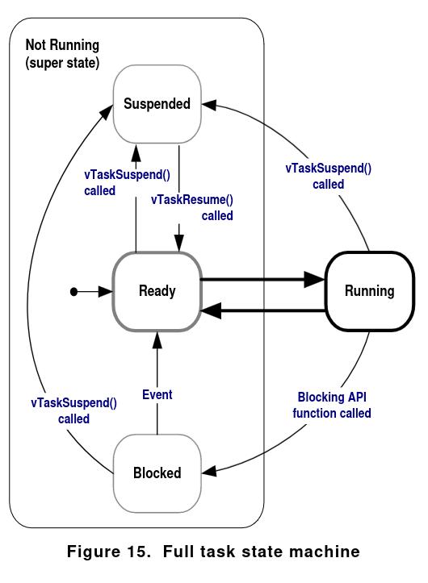

# Mastering the FreeRTOS Real Time Kernel - Book

* FreeRTOS is MISRA C Compliant. 

A FreeRTOS implementation for an specific compiler is called `port`. Sometimes, an implementation for a board may be called port too.

FreeRTOS needs a configuration file named `FreeRTOSConfig.h`, it varies depending on the implementation and processor used. So it's considered as a build file.

>- NOTE: FreeRTOS' github page has some demos, it is recommended to use a premade `FreeRTOSConfig.h` file.

## FreeRTOS.zip

The important files are placed in Source and Demo:

```
FreeRTOSv202212.01
├── FreeRTOS
│   ├── Demo
│   └── Source
│       ├── croutine.c
│       ├── event_groups.c
│       ├── list.c
│       ├── queue.c
│       ├── stream_buffer.c
│       ├── tasks.c
│       ├── timers.c
│       ├── include
│       │   └── *.h
│       └── portable
│           ├── Compiler1
│           │   └── Target(Architecture)
│           │       ├── port.c
│           │       └── portmacro.h
│           └── MemMang
│               ├── heap1.c 
│               ├── heap2.c
│               ├── heap3.c
│               ├── heap4.c
│               └── heap5.c
└── FreeRTOS-Plus
    ├── Demo
    └── Source
```
`tasks.c` &rarr; always required, it's used to create the tasks &rarr; threads.

`list.c` &rarr; always required

The usage of other files depends on the implementation.

The `port.c` file inside the architecure's dir has to be compiled too. For example, if the compiler is `GCC` and an ARM M0 is used (Raspberry Pi pico), the architecture is named `ARM_CM0`, so the file `FreeRTOS/Source/portable/GCC/ARM_CM0/port.c` has to be compiled.

If, in `FreeRTOSConfig.h`:
```c
#define configSUPPORT_DYNAMIC_ALLOCATION            1
```
is set, a heap memory manager is needed. Inside `MemMang` can be found 5 schemes, one of them has to be included and compiled for the project.


Include List:
- `FreeRTOSConfig.h`
- `FreeRTOS/Source/include` (includes `task.c` and the rest of src files)
- `FreeRTOS/Source/portable/<compiler>/<architecture>` 
- Heap Scheme if config is set

Main Header List:
- `FreeRTOS.h`
- Any FreeRTOS API function, e.g.: `task.h`

Each port has a unique `portmacro.h` header file, two important definitions are:

- `TickType_t` &rarr; FreeRTOS "creates" an interrupt called `tick interrupt`.
  - The number of tick interrupts since the FreeRTOS app started is called `tick count`
  - A `tick period` is the time between two tick interrupts.
  - `TickType_t` holds the tick count
  - In `FreeRTOSConfig.h` &rarr; if `configUSE_16_BIT_TICKS` == 1 it's defined as `uint16_t` else, if the config is set to 0, it's defined as `uint32_t`.
- `BaseType_t` &rarr; The most efficient data type for the architecture used. Usually, a 32-bit type for a 32-bit architecture and so on.

### Create a project

From the book:
> Every FreeRTOS port comes with at least one pre-configured demo application that should build with no errors or warnings. It is recommended that new projects are created by adapting one of these existing projects

## Heap Memory Management 

The kernel objects such as tasks, queues, semaphores and event groups are dynamically allocated at run-time; a dynamic allocation of memory is required each time a kernel object is created, and freed when it's deleted.

Instead of using `malloc()` and `free()` FreeRTOS uses a `pvPortMalloc()` and `vPortFree()`. This implementations varies depending on the `port/architecture` used

### Memory Allocation Schemes

- `heap1.c` &rarr; Very simple implementation of `pvPortMalloc()`, no `vPortFree()`.
  - Is deterministic, cannot fragment memory (useful for critical systems/implementations)
  - In `FreeRTOSConfig.h` &rarr; `config_TOTAL_HEAP_SIZE` defines the size of a block of memory that then is subdivided for every kernel object created or `pvPortMalloc()` call. E.g. a task needs a task control block (TCB) and a Stack; so the `TOTAL_HEAP_SIZE` will be initial RAM usage, but then it will be subdivided for every kernel object.
- `heap2.c` &rarr; `pvPortMalloc()` and `vPortFree()`
  - Not recommended, `heap4.c` provides better functionality.
  - It also uses a pre-defined heap size.
  - `pvPortMalloc()` uses the "best fit algorithm", it utilizes the available block of memory closest in size to the requested number of bytes.
  - It is more susceptible to memory fragmentation compared to heap4.
- `heap3.c` &rarr; standard `malloc()` and `free()`
  - The size of the heap is defined by the linker and not by the config file.
  - FreeRTOS scheduler is suspended temporarily when `malloc()` and `free()` are called to make them thread safe.
- `heap4.c` &rarr; generally, it is the most suitable choice for a standard implementation.
  - Similar to heap2, heap4 also implements the coalescence technique, which involves merging adjacent memory blocks to create larger ones, thus reducing memory fragmentation issues.
  - Using `configAPPLICATION_ALLOCATED_HEAP` is valuable for specifying the array heap's initiation point. This proves especially handy when the implementation necessitates situating the heap in internal high-speed memory, as opposed to slower external memory.
- `heap5.c` &rarr; is analogous to heap4, possessing the ability to allocate memory from multiple "memory arrays".
  - The task is accomplished through the utilization of the API function `vPortDefineHeapRegions()`.

### Utility Functions

- `size_t xPortGetFreeHeapSize( void );` - Not in heap3
- `size_t xPortGetMinimumEverFreeHeapSize( void );` - Returns the minimum number of unallocated bytes sin the FreeRTOS app started - Only in heap4 and heap5 
- if `configUSE_MALLOC_FAILED_HOOK` is set to 1, a function has to be defined `void vApplicationMallocFailedHook( void );` it handles the procedure to execute when `pvPortMalloc()` returns NULL &rarr; kernel object is not created.

## Task Management

A task is a simple function that returns void  and takes a void pointer as argument:
```c
void TaskNumber1(void *pvParameters);
```

An infinite loop is required to cyclically execute the intended task.

>- NOTE: If the variable created within the function is declared as `static`, it will be shared among all instances of the task.

On a single-core CPU, only one task can be active at a time, leading to the task being either in a `Running`(the task has been swapped in) or `Not Running`(the task has been swapped out) state.

### Create a Task &rarr; `xTaskCreate()`

```c
BaseType_t xTaskCreate( TaskFunction_t pvTaskCode,
                        const char * const pcName,
                        uint16_t usStackDepth,
                        void *pvParameters,
                        UBaseType_t uxPriority,
                        TaskHandle_t *pxCreatedTask );
```

#### Args:
- `pvTaskCode` &rarr; pointer to the task function, simply the name of the function. (it would be `TaskNumber1` in this case)
- `pcName` &rarr; description of the task.
- `usStackDepth` &rarr; number of words the stack can hold. 
  - `configMINIMAL_STACK_SIZE` &rarr; size of the stack used by the idle task. It's the minimum stack size recommended for any task.
  - >There is no easy way to determine the stack space required by a task. It is possible to calculate, but most users will simply assign what they think is a reasonable value, then use the features provided by FreeRTOS to ensure that the space allocated is indeed adequate, and that RAM is not being wasted unnecessarily.
- `pvParameters` &rarr; void pointer passed to the task as argument.
- `uxPriority` &rarr; priority of the task, 0 (lowest priority) to `configMAX_PRIORITIES` - 1 (highest priority)
- `pxCreatedTask` &rarr; task handler pointer, used to reference the task in API calls(delete, change priority, etc).

#### Return values:
- pdPASS &rarr; the task creation has succeeded.
- pdFAIL &rarr; insufficient heap memory, the task hasn't been created. `configUSE_MALLOC_FAILED_HOOK` can be set to handle this error.


### Example

```c
void TaskNumber1(void *pvParameters)
{
    /* Another task can be created here */
    for(;;)
    {
        /* Do something */
    }
}
```

And in `main` function:
```c
int main(void)
{

    /*This is defined const and not on the stack to ensure it remains valid when the tasks are executing. */
    static const char *pcText = "Text for TaskNumber1\r\n";

    xTaskCreate(TaskNumber1,
                "Description",
                1000,
                (void*)pcText,
                0,
                NULL);

    vTaskStartScheduler();

    /* The program should never reach this loop */
    /* Its purpose is to "prevent" certain errors. */
    for(;;);
}
```

### Task Priorities

- `vTaskPrioritySet()` - `configMAX_PRIORITIES`

It is advisable to set the `configMAX_PRIORITIES` value to the minimum required.

Two priority handling methods are available:

- Generic Method: This approach functions universally across various ports.
- Architecture Optimized Method: This method involves incorporating assembly code and is tailored to a particular port. Use the configuration `configUSE_PORT_OPTIMISED_TASK_SELECTION` to enable it.

If two tasks share the same priority, each task is executed for a specific duration known as a `time slice`, which corresponds to a single `tick period`. These tasks alternate between entering the running state and being swapped out. This behavior is controlled by the `Tick Interrupt` mechanism, configured by `configTICK_RATE_HZ`.

Useful implementations: 
```c
TickType_t xTimeInTicks = pdMS_TO_TICKS( 200 );
vTaskDelay( xTimeInTicks );
```

>- The length of time the task remains in the blocked state is specified by the vTaskDelay() parameter, but the time at which the task leaves the blocked state is relative to the time at which vTaskDelay() was called.

So, 

```c
void vTaskDelayUntil( TickType_t * pxPreviousWakeTime, TickType_t xTimeIncrement );
```

is more precise.

- `pxPreviousWakeTime` &rarr; must be initialized to the current tick count before it is used for the first time.

```c
/* [...] */
TickType_t xLastWakeTime = xTaskGetTickCount();
vTaskDelayUntil( &xLastWakeTime, pdMS_TO_TICKS( 250 ) );
/* [...] */
```

>- The scheduler will always select the highest priority task that is able to run.




#### The Idle Task

The idle task is constantly ready for execution, assigned a priority of 0.

An Idle Function Hook can be implemented if `configUSE_IDLE_HOOK` is set to 1 and the prototype of the function is `void vApplicationIdleHook( void );`. This function runs whenever the idle task is active.

`configIDLE_SHOULD_YIELD`:
- if it's set to 0 &rarr; the idle task will remain in the running state for the entirety of its time slice, umless preempted by a higher prio task.
- if it's set to 1 &rarr; the idle task is swapped out if there is other "idle priority == 0" tasks in the `Ready` state.

#### Change Priority/Delete

A `TaskHandle_t` should be passed by reference to the `xTaskCreate` function as the `pxCreatedTask` parameter. The Task Handler can be used inside any task.

Useful functions:
- `UBaseType_t uxTaskPriorityGet( TaskHandle_t pxTask );`
- `void vTaskPrioritySet( TaskHandle_t pxTask, UBaseType_t uxNewPriority );`
- `void vTaskDelete( TaskHandle_t pxTaskToDelete );`

if the `TaskHandle_t` parameter is `NULL` when the function is called within a task, it implies that the `TaskHandle_t`` is referring to the current task's handler. FreeRTOS automatically handles this situation.

>- NOTE: If an application uses the vTaskDelete() API function then it is essential that the Idle task is not starved of processing time. This is because the Idle task is responsible for cleaning up kernel resources after a task has been deleted.

### Scheduling Algorithm

The definitions to configure the algorithm are:

- `configUSE_PREEMPTION`
- `configUSE_TIME_SLICING`


In all possible configurations of `PREEMPTION` and `TIME_SLICING`, the FreeRTOS scheduler will ensure tasks that share priority are selected to entere the Running state in turn &rarr; known as `Round Robin Scheduling`.

Typically, both configs are set to 1.

if `PREEMPTION` is set to 0, the function `taskYIELD()` should be called manually inside a task to request a re-schedule. In this way, errors regarding tasks being interrupted by higher prio tasks are avoided.

Extra "mode":
- `configUSE_TICKLESS_IDLE` &rarr; Low power mode, is typically set to 0. If left undefined, the default behavior is equivalent to setting it to 0.


## Queue Management

- Queues are used as a mechanism of task-to-task communication and task-to-interrupt or interrupt-to-task communication.
- They can hold data elements. The number of elements is called the queue's length.
- The data elements can either consist of raw bytes (the actual value) or a pointer to the data. The latter option is preferred when the queue is concurrently used with substantial data chunks and the data size varies. However, care has to be taken. In the event that the task responsible for a data element's ownership is deleted, and a pointer to that value had been stored in a queue, potential errors could arise.
- Normally used as FIFOs.

### Create a Queue &rarr; `xQueueCreate()`

```c
QueueHandle_t xQueueCreate( UBaseType_t uxQueueLength, UBaseType_t uxItemSize );
```
```c
QueueHandle_t xQueueHandler;
int main(void)
{

    /*This is defined const and not on the stack to ensure it remains valid when the tasks are executing. */
    xQueueHandler = xQueueCreate( 5, sizeof( int32_t ) );

    if ( xQueueHandler != NULL ) 
    {
      /* Inside the task, "xQueueHandler" can be used. */
      xTaskCreate(TaskNumber1,
                  "Description",
                  1000,
                  (void*)pcText,
                  0,
                  NULL);
    }
    else 
    {
      /* handler error */
    }

    vTaskStartScheduler();

    /* The program should never reach this loop */
    /* Its purpose is to "prevent" certain errors. */
    for(;;);
}
```
#### Args:

- `uxQueueLength` &rarr; The maximum number of data items.
- `uxItemSize` &rarr; The size in bytes of each data item.

If it returns `NULL` there is insufficient mem available, else, the return value is the queue's handler. 

### Functions

```c
// Return value: pdPASS or errQUEUE_FULL
BaseType_t xQueueSendToBack( QueueHandle_t xQueue,       // Queue Handler
                             const void * pvItemToQueue, // Pointer to the data item
                             TickType_t xTicksToWait );  // Max Ticks the task remains blocked while waiting 
                                                         // for a space to become available.


// Return value: pdPASS or errQUEUE_EMPTY
BaseType_t xQueueReceive( QueueHandle_t xQueue,          // Queue Handler
                          void * const pvBuffer,         // Pointer to the memory in which the data item will be copied
                          TickType_t xTicksToWait );     // Max Ticks the task remains blocked while waiting 
                                                         // for a data item to become available.
```
- `UBaseType_t uxQueueMessagesWaiting( QueueHandle_t xQueue );` &rarr; returns the current number of data items in the queue.

If multiple sources write to a queue, the data item can be a `struct` holding the information and an ID.
A QueueSet(`xQueueCreateSet()`) can be created to achieve simmilar behaviour. But the a single Queue with `struct` data items is recommended.


### Mailbox Implementation 

A mailbox is essentially a specialized type of queue designed to hold just one data item. Unlike a standard queue, when a mailbox is read, the data item within doesn't disappear; it remains stored until it is overwritten. Different Tasks can read the data.

Functions Used:
- `BaseType_t xQueueOverwrite( QueueHandle_t xQueue, const void * pvItemToQueue );` &rarr; sends a data item to a queue, should only be used with a mailbox.
- `BaseType_t xQueuePeek( QueueHandle_t xQueue, void * const pvBuffer, TickType_t xTicksToWait );` &rarr; reads the data item of a mailbox.


## Software Timer Management

>- Software timers are implemented by, and are under the control of, the FreeRTOS kernel. They do not require hardware support, and are not related to hardware timers or hardware counters.

To use software timers:
- Build `FreeRTOS/Source/timers.c`
- `configUSE_TIMERS` has to be set to 1


### Functions

A timer callback function is needed:

```c
void ATimerCallback( TimerHandle_t xTimer );

// Return value: TimerHandle_t or NULL if the heap doesn't have space
TimerHandle_t xTimerCreate( const char * const pcTimerName,
                            TickType_t xTimerPeriodInTicks,   
                            UBaseType_t uxAutoReload,
                            void * pvTimerID,
                            TimerCallbackFunction_t pxCallbackFunction );

// Return value: pdPASS or pdFALSE
BaseType_t xTimerStart( TimerHandle_t xTimer, TickType_t xTicksToWait );
```

>- NOTE: The callback function should avoid entering the Blocked state, meaning it should not include delays or waiting operations.

There are two types of timers:
- One-Shot &rarr; only executed one time.
- Auto-reload &rarr; executed periodically.


>- All software timer callback functions execute in the context of the same RTOS daemon (or ‘timer service’) task. [...] Software timer API functions send commands from the calling task to the daemon task on a queue called the ‘timer command queue’.

This Daemon task needs the following configs:
- `configTIMER_TASK_STACK_DEPTH`
- `configTIMER_TASK_PRIORITY`
- `configTIMER_QUEUE_LENGTH`


Useful functions:
- `void vTimerSetTimerID( const TimerHandle_t xTimer, void *pvNewID );`
- `void *pvTimerGetTimerID( TimerHandle_t xTimer );`
- `BaseType_t xTimerChangePeriod( TimerHandle_t xTimer, TickType_t xNewTimerPeriodInTicks, TickType_t xTicksToWait );`
- `BaseType_t xTimerReset( TimerHandle_t xTimer, TickType_t xTicksToWait );`

>- [ ! ] NOTE : Semaphores function in a manner similar to that of a queue.  They are employed for synchronization purposes.

## Interrupt Management

Interrupts are hardware and Tasks are software.

- It is desirable to keep the ISRs as short as possible. `Deferred interrupt processing`, because the processing necessitated by the interrupt is `deferred` from the ISR to
a task.


>- NOTE: Never call a FreeRTOS API function that does not have “FromISR” in its name from an
ISR.

When the ISR exits, it makes a context switch, the task with higher priority should be executed. This may cause problems, because the IRQ may have been raised in a different task.

> The ISR controls the context switch, it doesn't occur automatically.

### Functions

> `taskYIELD()` is a macro that can be called in a task to request a context switch.

The following functions are safe versions of `taskYIELD()`, and both are used in the same way, some ports only offer one variant.

```c
portEND_SWITCHING_ISR( xHigherPriorityTaskWoken );
```

```c
portYIELD_FROM_ISR( xHigherPriorityTaskWoken );
```
>- The interrupt will always return to the task in the
Running state, even if the task in the Running state changed while the interrupt was executing.

> Semaphores and Queues are used for Synchronization.

### Binary Semaphore

The binary semaphore blocks and unblocks tasks. 

```c
SemaphoreHandle_t xSemaphoreCreateBinary( void );


// pdMS_TO_TICKS() can be used
BaseType_t xSemaphoreTake( SemaphoreHandle_t xSemaphore, TickType_t xTicksToWait );

BaseType_t xSemaphoreGiveFromISR( SemaphoreHandle_t xSemaphore, BaseType_t *pxHigherPriorityTaskWoken );
```

>- Operations can be deferred to the RTOS Daemon Task, so that no extra tasks have to be created.

## Resource Management

The transition between tasks and even tasks and ISRs can cause data corruption. If two tasks/ISRs want to write to a peripheral, the data they are writting may overlap if the transition is not handled properly.

if a function has a `static` variably, it is said that is not `reentrant` &rarr; it is not safe to call it by multiple tasks.

Always try to use one task to handle a resource. Mutex techniques can be used if it's not the case.

### Critical Sections

Critical sections disable interrupts, so the task that entered the critical section will remain in the running state until the critical section is exited.

```c
taskENTER_CRITICAL();
//[...]
taskEXIT_CRITICAL();
```

### Locking the Scheduler

Interrupts remain enabled, locking the scheduler protect regions of code from access by other tasks.

```c
void vTaskSuspendAll( void );
//[...]
BaseType_t xTaskResumeAll( void );
```

When using a Mutex, take into account the possible deadlocks and priority inversions. (Gatekeeper Tasks may help)

## Event Groups

In simple terms, a Event Group is a variable that holds flags, each bit of the variable is a flag that can be set to `1` or cleared to `0`.

>- Event groups allow a task to wait in the Blocked state for a combination of one of more
events to occur.

>- Event groups unblock all the tasks that were waiting for the same event, or combination
of events, when the event occurs.

>- The number of event bits in an event group is dependent on the `configUSE_16_BIT_TICKS`
compile time configuration constant within `FreeRTOSConfig.h`

- if `configUSE_16_BIT_TICKS is 1` &rarr; 8 event bits &rarr; 8 flags
- if `configUSE_16_BIT_TICKS is 0` &rarr; 24 event bits &rarr; 24 flags

### Functions

```c
EventGroupHandle_t xEventGroupCreate( void );

EventBits_t xEventGroupSetBits( EventGroupHandle_t xEventGroup, const EventBits_t uxBitsToSet );

BaseType_t xEventGroupSetBitsFromISR( EventGroupHandle_t xEventGroup, const EventBits_t uxBitsToSet, BaseType_t *pxHigherPriorityTaskWoken );
// [..] There are more functions
```

Event Groups are useful for Task Synchronization.

```c
EventBits_t xEventGroupSync( EventGroupHandle_t xEventGroup,
const EventBits_t uxBitsToSet,
const EventBits_t uxBitsToWaitFor,
TickType_t xTicksToWait );
```

## Task Notifications

Instead of using a "data structure" like a semaphore, queue or event group, the tasks can communicate with each other without the need of an intermediary.

To enable Task Notifications &rarr;  set `configUSE_TASK_NOTIFICATIONS to 1` in `FreeRTOSConfig.h`

Task notifications are faster than any other way of communication between tasks. They also use less RAM. But only work in certain scenarios:

ISR &rarr; TASK
ISR &larr; TASK (NOT POSSIBLE)

Only 2 TASKs or ISR with TASK can interact, Semaphores or EventGroups can be accessed by all tasks or ISRs(with its respective `handle_t`).

### Functions

```c
// Simpler version of xTaskNotify()
BaseType_t xTaskNotifyGive( TaskHandle_t xTaskToNotify );

// Simpler version of xTaskNotifyFromISR()
void vTaskNotifyGiveFromISR( TaskHandle_t xTaskToNotify, BaseType_t *pxHigherPriorityTaskWoken );

// Simpler version of  xTaskNotifyWait()
uint32_t ulTaskNotifyTake( BaseType_t xClearCountOnExit, TickType_t xTicksToWait );
```

`uint32_t ulTaskNotifyTake()` is used as a lightweight binary semaphore, it allows a task to wait in the blocked state.

# Extra Books

- Qing Li, Caroline Yao - Real-Time Concepts for Embedded Systems

[ ? ] Data-Bus or Memory Mapping(MM)? They should be the same concept, the MM design also enables and disables communication devices

---

- Design Patterns for Embedded Systems in C


# FreeRTOS Useful Links

* [RTOS for ARM Cortex-A](https://www.freertos.org/Using-FreeRTOS-on-Cortex-A-Embedded-Processors.html)

* [FreeRTOS_quickguide](https://freertos.org/FreeRTOS-quick-start-guide.html) 

* [RTOS_book](https://freertos.org/Documentation/RTOS_book.html) 

* [Porting](https://freertos.org/porting-a-freertos-demo-to-different-hardware.html) 

* [FreeRTOS on RISC-V](https://freertos.org/Using-FreeRTOS-on-RISC-V.html)


