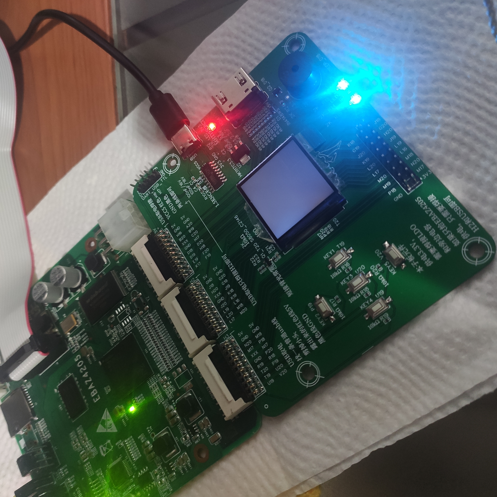

# RISCV Intro

This repository has some notes and code relevant regarding RISCV, RV32I or RV32E more specifically. I've been doing some FPGA coding with verilog following BrunoLevy's repo; i used a DE0nano from Intel, a ZYNQZ7010 from Xilinx and a Tangnano9k from GOWIN. The board focused was the ZYNQ for its capabilities with the AXI protocol. 

Also, i tried to program the ESP32-C3, which has a dualcore RISCV, with various SDKs and many programming languages.

Last but not least, i discovered the CH32VXXX family, it's a series of RV32E microcontrollers with outstanding capabilities. The CH32V003 is cheap, the CH32V203 has USB 2.0 support, and the CH32V307 has Ethernet and USB 2.0. PlatformIO's SDK is better than the manufacturer's SDK(MounRiver).

## EBAZ4205 (ZYNQ cheap BTC miner board)

## DE0nano running part of RISCV implementation from BrunoLevy

